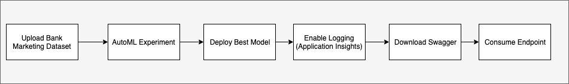
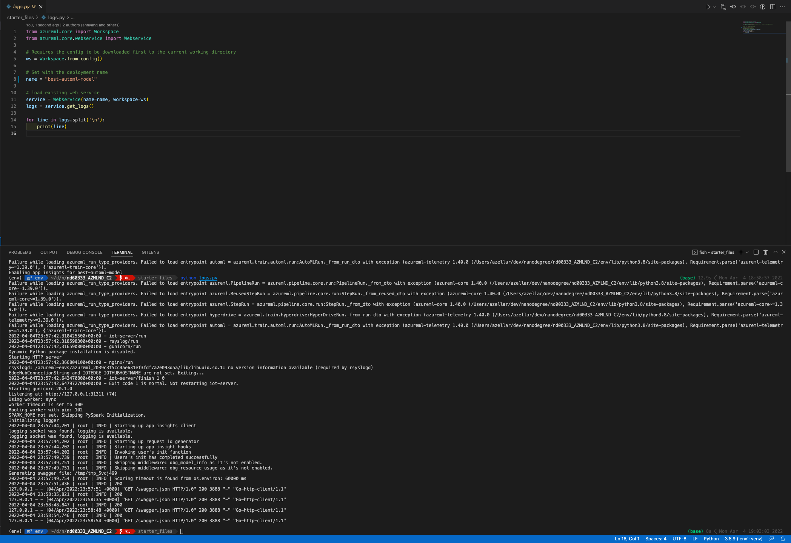
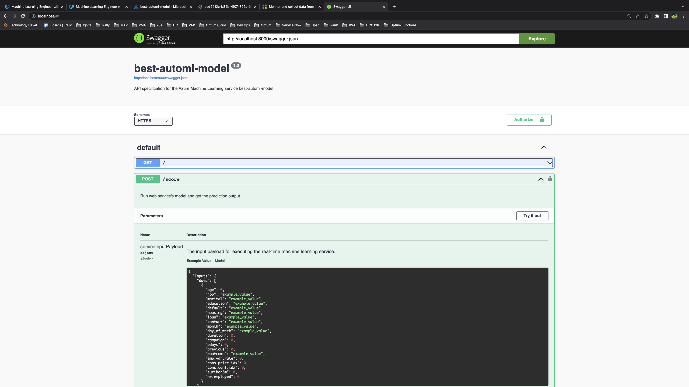
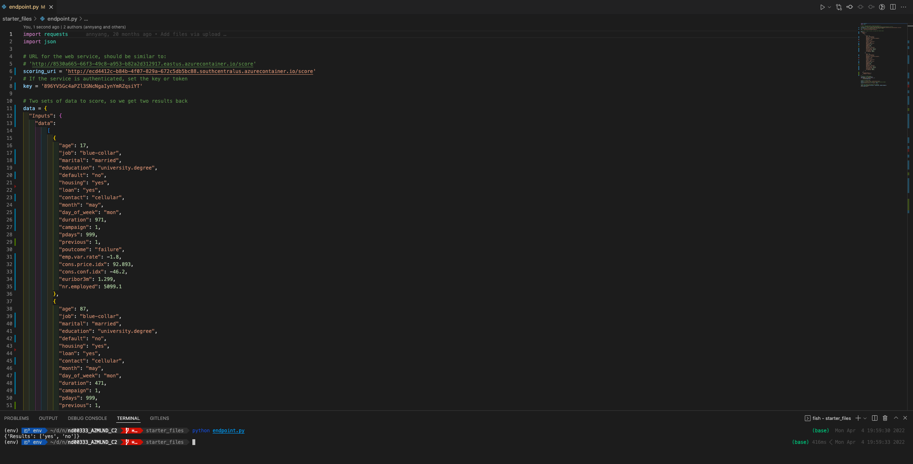
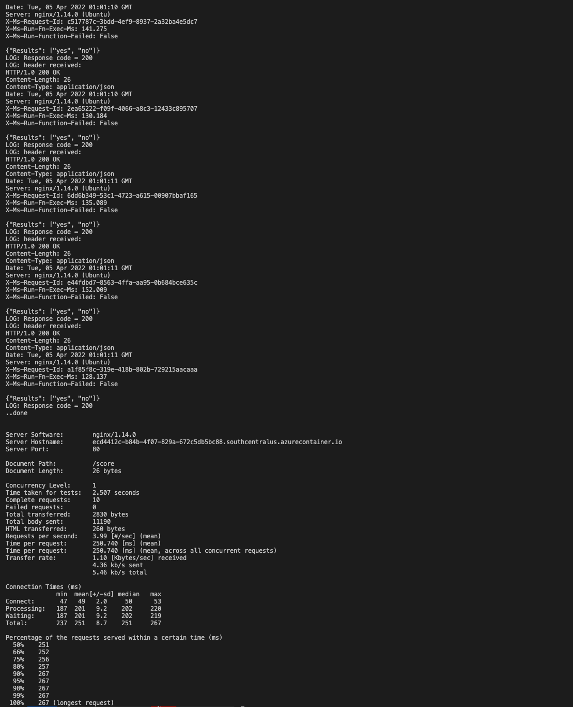
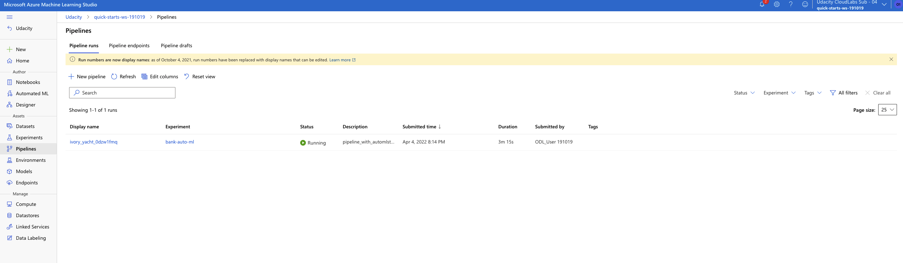
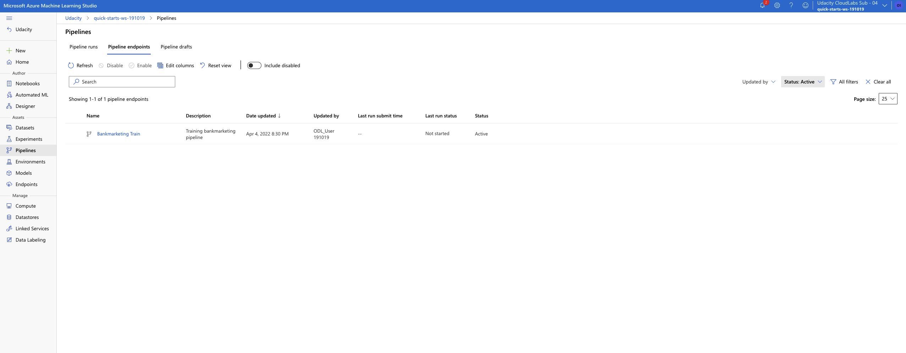
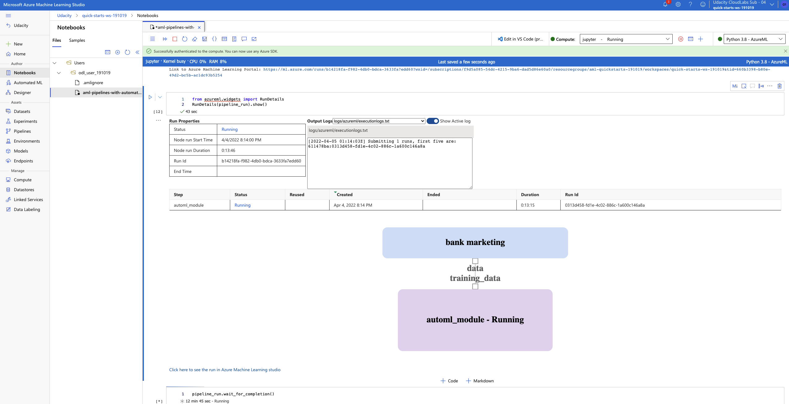

# Operationalizing Machine Learning

In this project I was tasked with creating, training and deploying an automl model. I setup the endpoint to have authorization and tested the deployed automl model by making requests via a python script. I also created and published a pipeline that could do all of the steps of creating and automl model. Lastly, I used a rest endpoint to interact with the published pipeline.

## **Architectural Diagram**

## **Key Steps**
## AutoMl Experiment
## Step 1: Uploaded bank marketing dataset

Uploaded the provided bank marketing dataset to AzureML Studio

**Bank Marketing dataset**

## Step 2: Setup and run an AutoML experiment with bank marketing dataset

Create a compute cluster then a new AutoML experiment to try and find the best classification model for the bank marketing dataset

**Completed Experiment Run**

**Best Model**

## Step 3: Deploy the best model from the experiment with authentication

Deployed the best model from the data set which had wighted AUC of 0.94782 with authentication. Next enabled application insights and tested with [logs.py](./starter_files/logs.py)

**Application Insights Enabled Endpoint with [enable_ai.py](./starter_files/enable_ai.py)**

**Output from logs.py**

## Step 4: Download and run swagger on localhost

Downloaded the swagger json then ran a local instance of swagger and loaded the json into to be able to try it in a browser

**Swagger for API**

## Step 5: Consume model endpoints with [endpoints.py](./starter_files/endpoint.py)

Used provided script to consume the endpoint and get actual results from the deployed model

**Endpoint Results**

## Step 6: (Optional) Benchmark Endpoint
Used the Apache bench tool to benchmark the endpoint

**Benchmark Output**

 

## Pipeline
## Step 1: Create pipeline from provided [jupyter notebook](./starter_files/aml-pipelines-with-automated-machine-learning-step.ipynb)

Followed the steps in the provided jupyter notebook and updated values for my workspace to create a new pipeline in AzureML studio

**Created Pipeline**

**Bank marketing set with pipeline**

## Step 2: Publish Pipeline
Continued using the jupyter notebook to publish the pipeline I had created so it could be used as an HTTP endpoint

**Published Pipeline**

## Step 3: Use Published pipeline

Used the published pipeline to create another automl experiment

**Run details from pipeline in progress**

**Run details from pipeline completed**

**Scheduled fruns from using published pipeline**

## Screen Recording

[Screenrecording](https://youtu.be/OecewP26IAc)

## Future Imporvements

We could improve the perfomance of the endpoint by running it within kubernetes instead of Azure Container Instance. Also with more nodes we could train the AutoML model faster