# Operationalizing Machine Learning

In this project I was tasked with creating, training and deploying an automl model. I setup the endpoint to have authorization and tested the deployed automl model by making requests via a python script. I also created and published a pipeline that could do all of the steps of creating and automl model. Lastly, I used a rest endpoint to interact with the published pipeline.

## Architectural Diagram
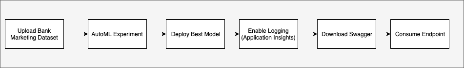

## Key Steps
* AutoMl Experiment
  1. Uploaded bank marketing dataset
    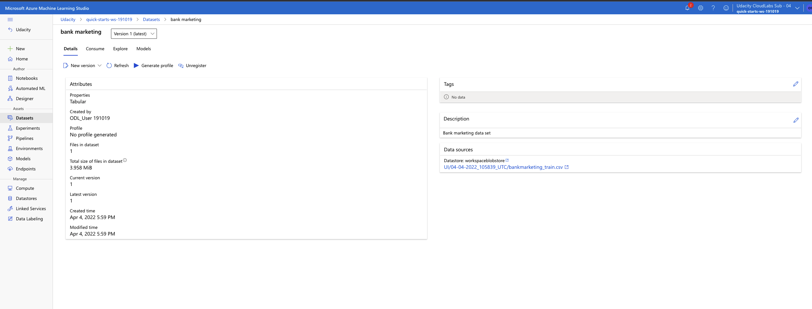
  1. Setup and run an AutoML experiment with bank marketing dataset 
    Completed Run
    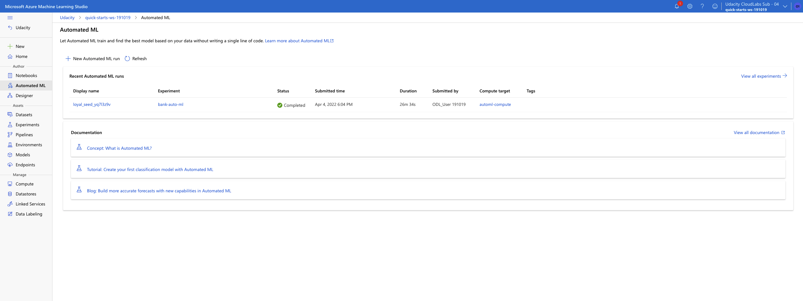
    Best Model
    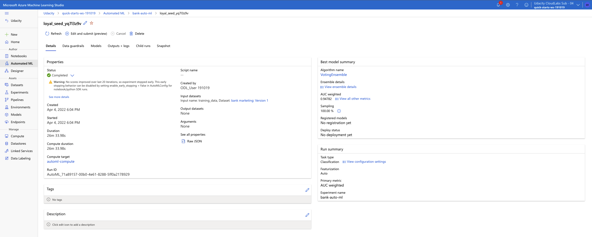
  1. Deploy the best model from the experiment with authentication then test with [logs.py](./logs.py) 
    Application Insights Enabled Endpoint with [enable_ai.py](./enable_ai.py):
    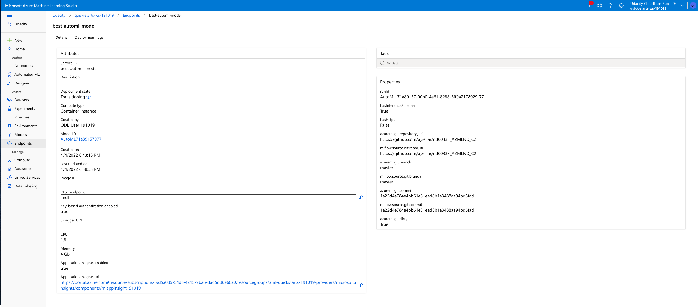
    Output from logs.py
    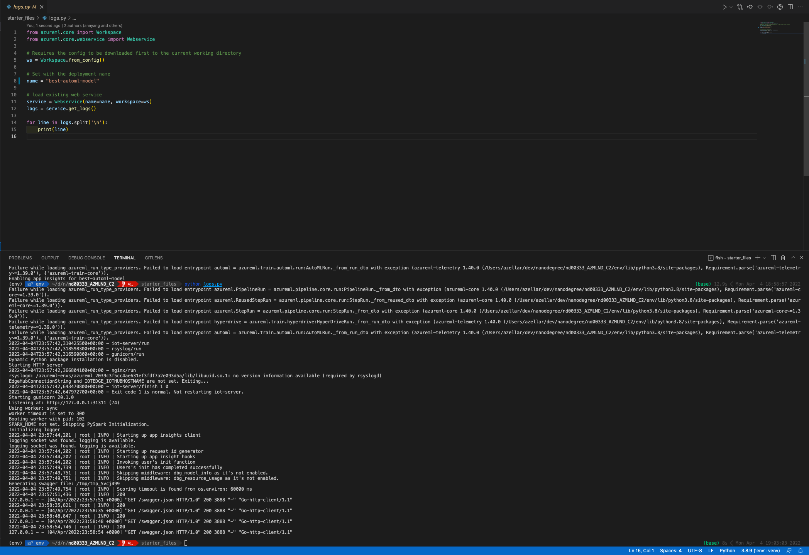
  1. Download and run swagger on localhost
    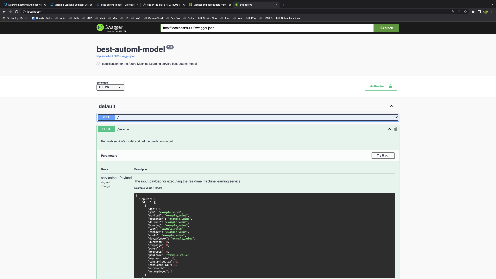
  1. Consume model endpoints with [endpoints.py](./endpoint.py)
    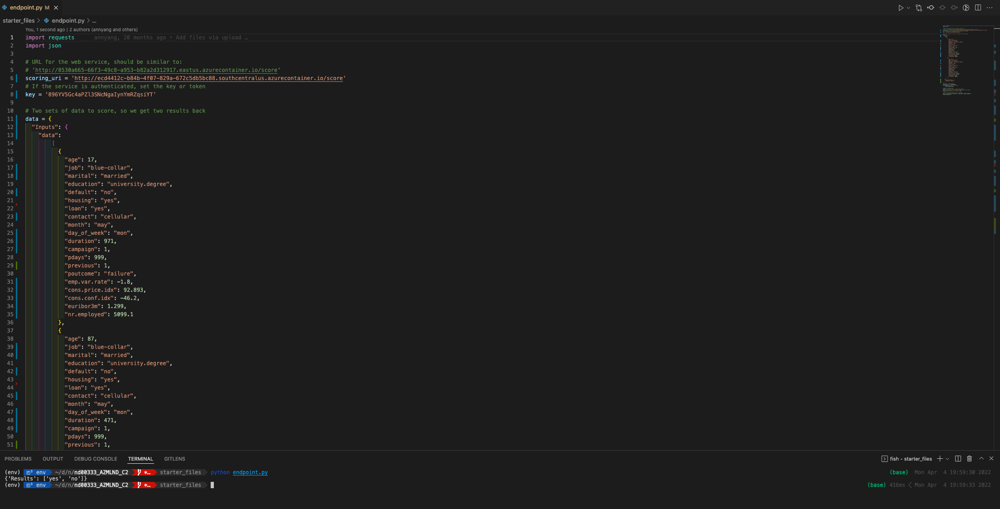
  1. (Optional) Benchmark Endpoint
    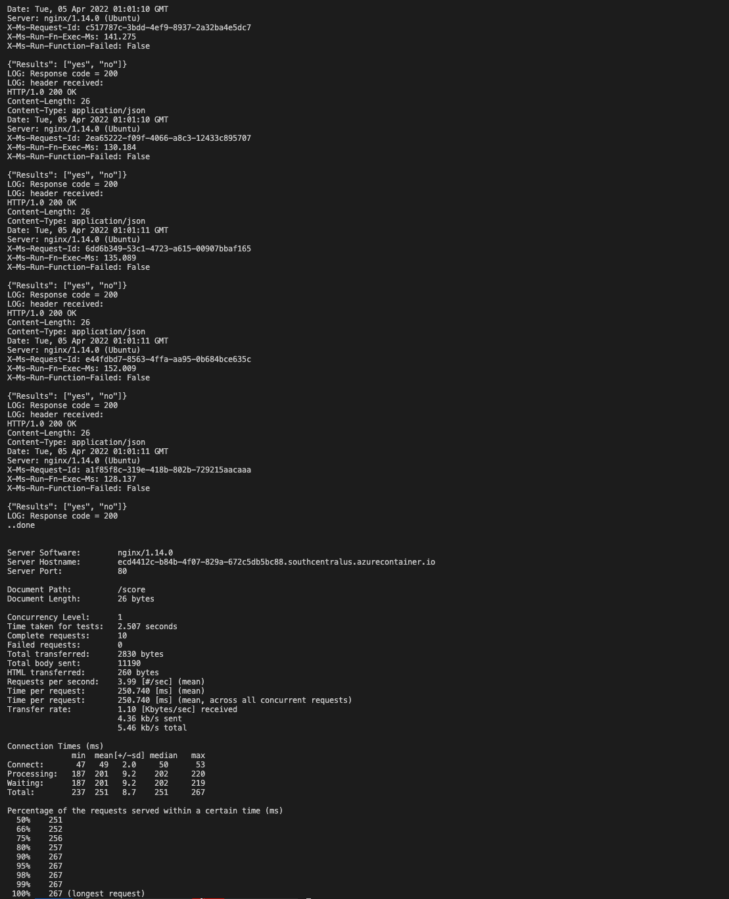

* Pipeline
    1. Create pipeline from provided [jupyter notebook](./aml-pipelines-with-automated-machine-learning-step.ipynb)
    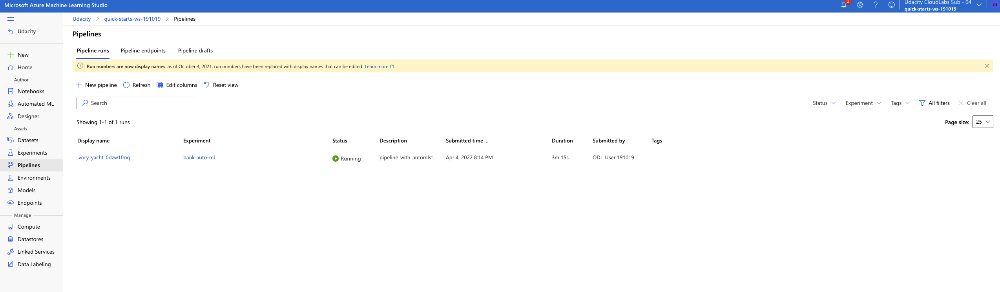
    Bank marketing set with pipeline
    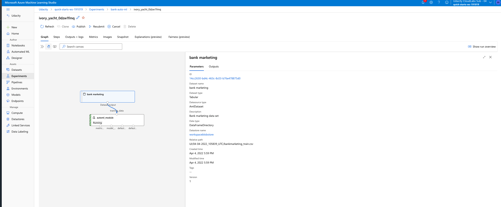
    1. Publish Pipeline
    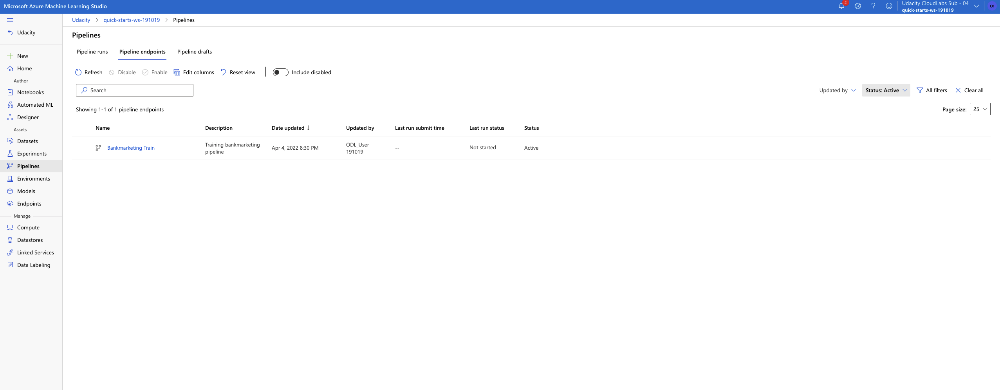
    1. Use Published pipeline 
    Run details from pipeline in progress
    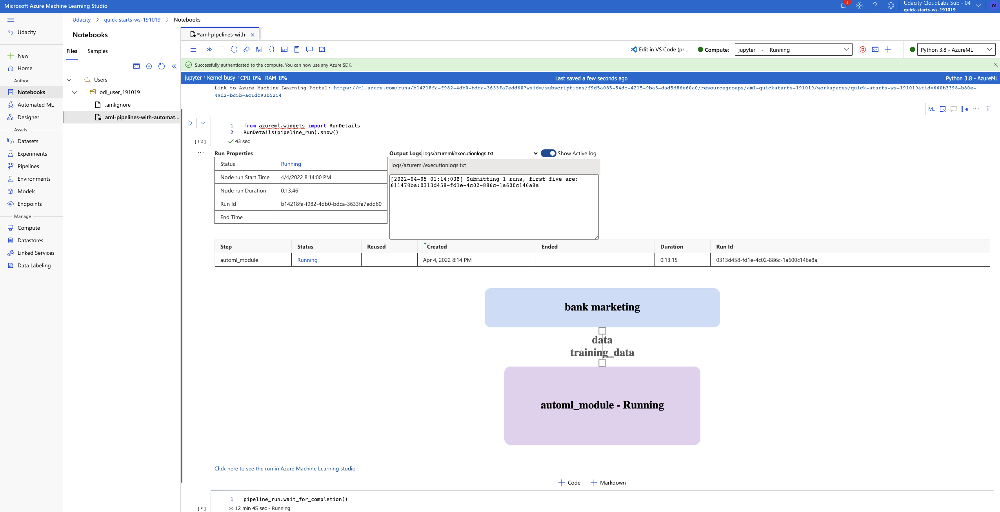
    Run details from pipeline completed
    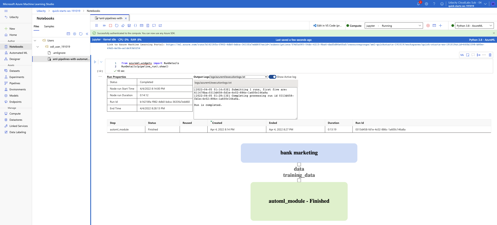
    Scheduled fruns from using published pipeline
    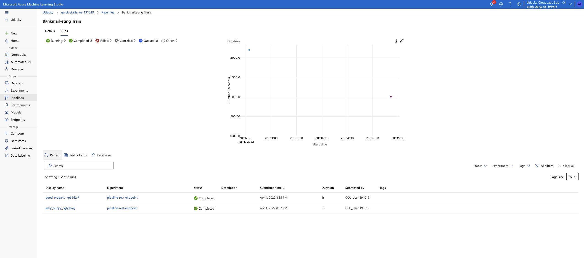

## Screen Recording

[Screenrecording](https://youtu.be/OecewP26IAc)
